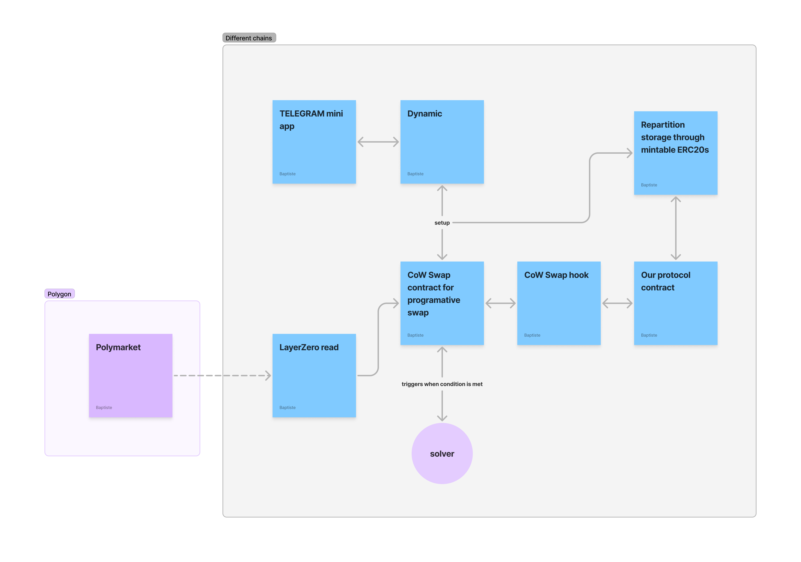

# poly-swap-core

PolySwap solves an important consumer hurdle. The crypto market regularly lives through periods of market volatility caused by large events related to politics, sports or other. Let's take the example of the latest US election. Many predicted that the election of Donald Trump would lead to a crypto pump and were in the need to swap from stable coins to various crypto currencies as soon as the result would approach finality in order to benefit from the price action.

This was easier said than done as you would need to manually make all swaps at the right time.

PolySwap allows you to trustlessly and automatically pull data from prediction markets to trigger DeFi swaps across chains.

## Authors

- [Lucas Leclerc](https://github.com/Intermarch3)
- [Pierre Guéveneux](https://github.com/Pierregvx)
- [Baptiste Florentin](https://pyba.st)

## Technologies

- LayerZero read functionnality 🪨

Allows any chain to trustlessly read the state of Polymarket on the Polygon blockchain.

- CoW Swap's intent based and programmatic DeFi swaps 🪨

It allows for seamless automation of processes and prevents from overloading the LayerZero read execution callback.

- Polymarket 🪨

Allows access to reliable predictions backed by deep liquidity to trigger user's swaps. We use their API in the frontend to allow users to choose their preferred markets.

- Telegram 🪨

Our frontend is compatible with the telegram mini-app format.

- Dynamic 🪨

For easy wallet connection and user experience across devices

## Technologies

- Circle's CCTP 🐣

For whales, moving USDC coins to the chains with most liquidity before swapping is key to a good liquidity management. CCTP is the solution to allow for easy and secure native briding backed by LayerZero's multichain read functionnality.

- Euler Deposit 🐣

To access the best APYs during low volatility times, Euler's lending platform is a no brainer. Our telegram mini-app is especially interesting to bring great UX to lending and borrowing.

🪨 Implemented

🐣 Upcoming

## Architecture

## Contracts

| Chain             | address                                                                                                                      |
| ----------------- | ---------------------------------------------------------------------------------------------------------------------------- |
| Sepolia arbistrum | [0xc3b689cB1DA423025953d70961b623773a4Cb3Ae](https://sepolia.arbiscan.io/address/0xc3b689cB1DA423025953d70961b623773a4Cb3Ae) |

## Transaction Examples

Deployment: [0x234e1965d0f6728807c803e2f41c1740c1ae4bb8f4618b2359908fea27bec7e0](https://sepolia.arbiscan.io/tx/0x234e1965d0f6728807c803e2f41c1740c1ae4bb8f4618b2359908fea27bec7e0)

Solver Execution: [0xbb7c56ee10380965d2c2954de9c5dcbefecca66cc5a4f100126bdacbfebf901f](https://sepolia.arbiscan.io/tx/0xbb7c56ee10380965d2c2954de9c5dcbefecca66cc5a4f100126bdacbfebf901f)

LayerZero Read Request
[0xbb7c56ee10380965d2c2954de9c5dcbefecca66cc5a4f100126bdacbfebf901f](https://layerzeroscan.com/tx/0xbb7c56ee10380965d2c2954de9c5dcbefecca66cc5a4f100126bdacbfebf901f)

LayerZero Read Callback
[0x6586fcb98518dbad0321d235df9f83971259edaba455f6f4ccf3f2e903e2bf5f](https://sepolia.arbiscan.io/tx/0x6586fcb98518dbad0321d235df9f83971259edaba455f6f4ccf3f2e903e2bf5f)

## Limitations

- LZ read to Polygon is not accessible on mainnet so we proved the concept by reading from an ERC20 token on Base Sepolia
- Security was not prioritized during this hackathon, there is a lot of improvements to be made in this sense
- The app is not fully connected yet, we would need to add an indexing solution
- We only allow for a single type of swap yet, allowing modularity in the possible swaps and even allowing broader web3 actions would be an interesting area to explore
